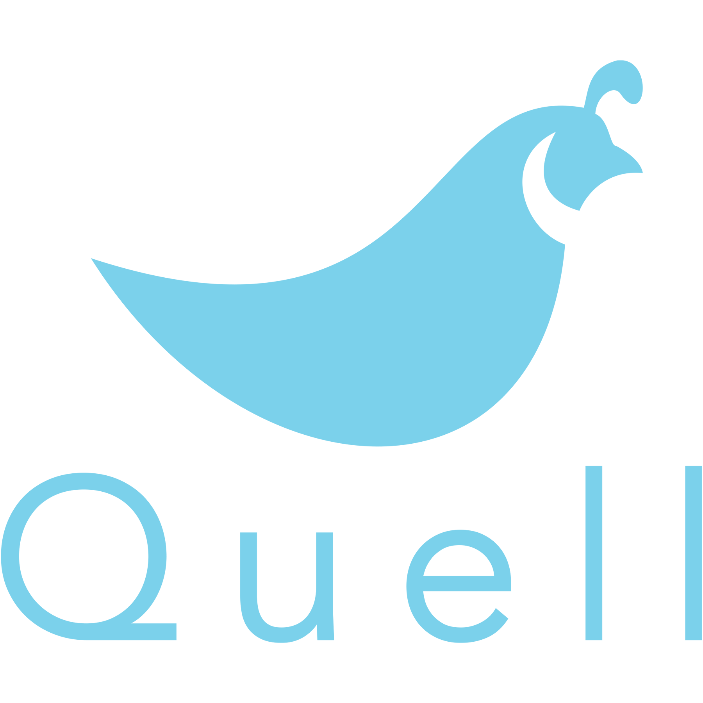

#

# Quell

Quell is an open-source NPM package providing a light-weight caching layer implementation for GraphQL responses on both the client- and server-side. Use Quell to prevent redundant client-side API requests and to minimize costly server-side response latency.

Developed by Nick Kruckenberg, Michael Lauri, Rob Nobile, and Justin Jaeger under [OSLabs](https://opensourcelabs.io/).

## Features

Version 1.0 features:

Client-side caching utilizing sessionStorage
Server-side caching utilizing a configurable Redis in-memory data store
Automatic unique cache key generation
Partial and exact match query caching
Programmatic rebuilding of GraphQL queries to fetch only the minimum data necessary to complete the response based upon current cache contents

Quell does **not** currently support Mutations, Subscriptions, Arguments, Directives, or Variables.

## Installation

Quell is divided up into two npm packages:

Download Quell-Client from npm in your terminal with `npm i @quell/client`.
Download Quell-Server from npm in your terminal with `npm i @quell/server`.

## General Requirements

To utilize server-side caching, install Redis:

- Mac-Homebrew:

  - in terminal, type `brew install redis`
  - after installation completes, type `redis-server`

- Linux/Non-Homebrew:

  - [redis.io/download](https://redis.io/download)
  - follow cli installation instructions
  - be sure to locate the file path from your project directory to your redis server

  [Click here for Quell-Client README](./quell-client/README.md)
  [Click here for Quell-Client README](./quell-server/README.md)

  ## Contribute to Quell

Interested in making a contribution to Quell? [Click here](./CONTRIBUTING.md) to check out our open-source contribution guidelines.

Thank you for your interest and support!
Team Quell
