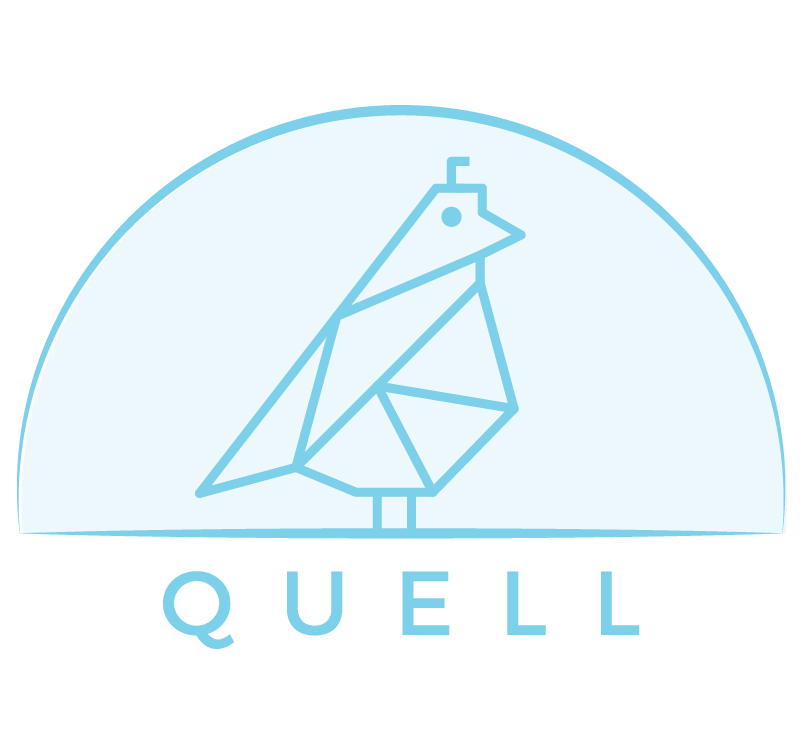

# Quell

Quell is an easy-to-use, lightweight JavaScript library providing a client- and server-side caching solution and cache invalidation for GraphQL.

## Installation

### Quell-Client and Quell-Server

Quell is divided into two npm packages:

- Download @quell/client from npm in your terminal with `npm i @quell/client`
- Download @quell/server from npm in your terminal with `npm i @quell/server`

## Features

- IP-Rate Limiting to protect your server.
- Successfully handling cache mutations with cache invalidation.
- Quell/server offers optional depth and cost limiting middleware to protect your GraphQL endpoint! To use, please explore the [@quell/server readme](./quell-server/README.md).
- Server-side cache now caches entire queries in instances where it is unable to cache individual datapoints.
- Client-side caching utilizing LokiJS.
- Server-side caching utilizing a configurable Redis in-memory data store with batching.
- Partial and exact match query caching.
- Programmatic rebuilding of GraphQL queries to fetch only the minimum data necessary to complete the response based upon current cache contents.
- A easy-to-use Chrome Developer Tools extension designed for Quell users. With this extension, users can:
  - Inspect and monitor the latency of client-side GraphQL/Quell requests.
  - Make and monitor the latency of GraphQL/Quell requests to a specified server endpoint.
  - View server-side cache data and contents, with the ability to manually clear the cache
  - Features require zero-to-minimal configuration and can work independently of `@quell/client` and `@quell/server`

### Demo

The first bar represents an uncached client-side query and the second bar represents the response time of a cached request.

 
 

A demonstration of how Quell can be implemented to protect against costly network requests.

 
 

Try Quell out [here](https://quell.dev/)

#### Usage Notes

- Currently, Quell can cache 1) query-type requests without variables or directives and 2) mutation-type requests (add, update, and delete) with cache invalidation implemented. Quell will still process other requests, but will not cache the responses.

### Quell Developer Tool

Quell Developer Tool is currently available as a Chrome Developer Tools extension. The easiest way to get it is to [add it from the Chrome Web Store.](https://chrome.google.com/webstore/detail/quell-developer-tool/jnegkegcgpgfomoolnjjkmkippoellod)

## Documentation

- [@quell/client README](./quell-client/README.md)
- [@quell/server README](./quell-server/README.md)
- [Quell Developer Tool README](./quell-extension/README.md)
- [Quell Demo Repo](https://github.com/oslabs-beta/QuellDemo-ts-7.0)

### Contribute to Quell

Interested in making a contribution to Quell? Find our open-source contribution guidelines [here](./CONTRIBUTING.md). Please feel free to also review the larger future direction for Quell in the Client and Server readme's.

Thank you for your interest and support!

-Team Quell

## Quell Contributors

Accelerated by [OS Labs](https://github.com/open-source-labs) and developed by [Angelo Chengcuenca](https://github.com/amchengcuenca), [Emily Hoang](https://github.com/emilythoang), [Keely Timms](https://github.com/keelyt), [Yusuf Bhaiyat](https://github.com/yusuf-bha), [Hannah Spencer](https://github.com/Hannahspen), [Garik Asplund](https://github.com/garikAsplund), [Katie Sandfort](https://github.com/katiesandfort), [Sarah Cynn](https://github.com/cynnsarah), [Rylan Wessel](https://github.com/XpIose), [Alex Martinez](https://github.com/alexmartinez123), [Cera Barrow](https://github.com/cerab), [Jackie He](https://github.com/Jckhe), [Zoe Harper](https://github.com/ContraireZoe), [David Lopez](https://github.com/DavidMPLopez), [Sercan Tuna](https://github.com/srcntuna), [Idan Michael](https://github.com/IdanMichael), [Tom Pryor](https://github.com/Turmbeoz), [Chang Cai](https://github.com/ccai89), [Robert Howton](https://github.com/roberthowton), [Joshua Jordan](https://github.com/jjordan-90), [Jinhee Choi](https://github.com/jcroadmovie), [Nayan Parmar](https://github.com/nparmar1), [Tashrif Sanil](https://github.com/tashrifsanil), [Tim Frenzel](https://github.com/TimFrenzel), [Robleh Farah](https://github.com/farahrobleh), [Angela Franco](https://github.com/ajfranco18), [Ken Litton](https://github.com/kenlitton), [Thomas Reeder](https://github.com/nomtomnom), [Andrei Cabrera](https://github.com/Andreicabrerao), [Dasha Kondratenko](https://github.com/dasha-k), [Derek Sirola](https://github.com/dsirola1), [Xiao Yu Omeara](https://github.com/xyomeara), [Nick Kruckenberg](https://github.com/kruckenberg), [Mike Lauri](https://github.com/MichaelLauri), [Rob Nobile](https://github.com/RobNobile) and [Justin Jaeger](https://github.com/justinjaeger).
